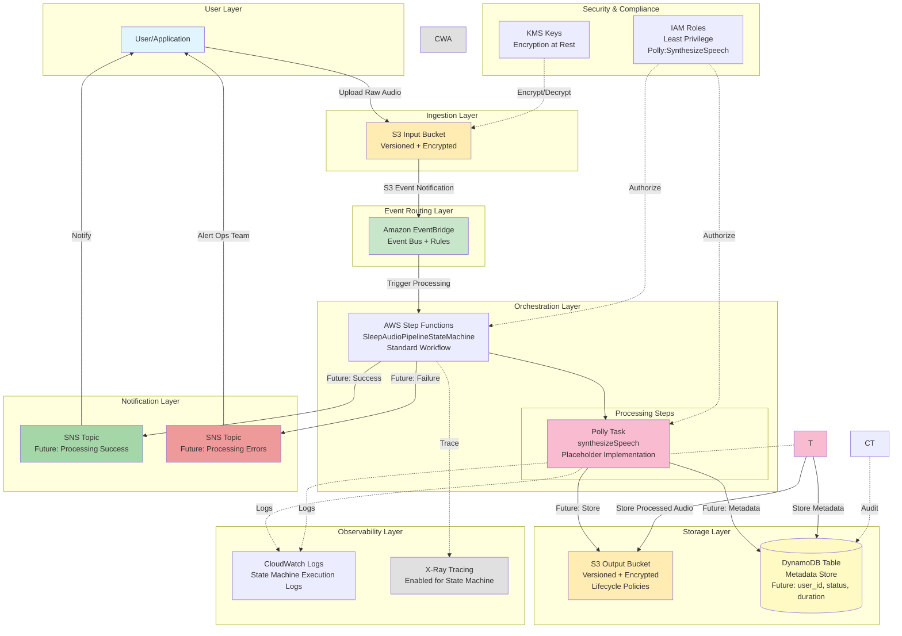

# Sleep Audio Pipeline Architecture

## Overview

This document serves as the **source of truth** for the event-driven sleep audio pipeline built on AWS using CDK Go. The system is designed to process sleep-related audio files through a fully serverless, event-driven architecture, ensuring scalability, reliability, security, and maintainability while following AWS Well-Architected principles.

This is a living document that will evolve alongside the implementation. All architectural decisions, component interactions, and design rationale are documented here.

## System Description

The sleep audio pipeline is a production-grade, fully serverless system that enables users to upload raw audio files (voice recordings, ambient sounds, meditation guides) and automatically processes them into high-quality sleep audio content. The system leverages AI services like Amazon Polly for text-to-speech generation and AWS Bedrock for AI-enhanced audio content.

### Key Principles

- **Event-Driven Architecture**: All components communicate asynchronously through events, enabling loose coupling, independent scaling, and resilient operations
- **Serverless-First**: Leverages fully managed AWS services to eliminate infrastructure management overhead
- **Security by Design**: Implements least-privilege IAM roles, encryption at rest and in transit, and private networking
- **Observable and Auditable**: Comprehensive logging, metrics, alarms, and distributed tracing for operational excellence
- **Multi-Environment**: Supports dev, stage, and prod environments with consistent configuration management via CDK context
- **Well-Architected**: Adheres to all six pillars of the AWS Well-Architected Framework
- **Cost-Optimized**: Intelligent resource sizing, lifecycle policies, and pay-per-use pricing models

## Architecture Diagram



## Detailed Component Description

### 1. Ingestion Layer

#### S3 Input Bucket

**Purpose**: Entry point for all raw audio files uploaded by users or applications.

**Configuration**:
- **Versioning**: Enabled to preserve file history and support rollback
- **Encryption**: Server-side encryption using AWS KMS with customer-managed keys
- **Access Control**: Private bucket with no public access; access via pre-signed URLs or IAM roles only
- **Event Notifications**: Configured to send S3 events to EventBridge on `s3:ObjectCreated:*` events
- **Supported Formats**: MP3, WAV, FLAC, M4A, OGG, and raw text files for TTS generation
- **Size Limits**: Configurable via CDK context (default: 100MB per file)
- **Lifecycle Policies**: Optional transition to Glacier after 90 days for cost optimization

**Why S3?**
- Highly durable (99.999999999% durability)
- Scalable to handle any number of concurrent uploads
- Native integration with EventBridge
- Cost-effective storage with intelligent tiering

### 2. Event Routing Layer

#### Amazon EventBridge

**Purpose**: Decouples event producers from consumers, providing flexible event routing and filtering.

**Configuration**:
- **Event Bus**: Custom event bus for sleep audio pipeline events
- **Event Rules**: Filter events based on:
  - File extension (`.mp3`, `.wav`, `.txt`, etc.)
  - File size (skip files that are too large or too small)
  - Metadata tags (priority processing, user tier)
  - Custom event patterns for advanced routing
- **Targets**: Routes to Step Functions state machine for orchestrated processing
- **Archive**: Optionally archive events for replay and debugging (configurable retention)
- **DLQ**: Dead-letter queue for failed event deliveries

**Why EventBridge?**
- Schema registry for event structure validation
- Event replay capabilities for recovery scenarios
- Enables future integrations without modifying existing components
- Built-in filtering reduces unnecessary Lambda invocations
- Provides event archive for audit and compliance

### 3. Processing Layer

#### AWS Step Functions State Machine

**Purpose**: Orchestrates multi-step audio processing workflow with error handling, retries, and parallel execution.
**Current Implementation (Issue #4 - Minimal Skeleton)**:

The state machine currently implements a **minimal skeleton** with basic Amazon Polly integration as the first processing step:

1. **Polly Task** (AWS Service Integration)
   - Direct service integration using Step Functions' `CallAwsService` task
   - Placeholder parameters:
     - Text: "This is a placeholder for sleep audio generation"
     - VoiceId: "Joanna" (neural voice)
     - OutputFormat: "mp3"
     - Engine: "neural"
   - IAM permissions: `polly:SynthesizeSpeech` (least privilege)
   - Result stored in `$.pollyResult` for future processing steps

This minimal implementation serves as the foundation for the complete workflow. Future issues will extend the state machine with additional processing steps.


**Workflow Design**:
1. **Validation Step** (Lambda) - **Future Implementation**
1. **Validation Step** (Lambda)
   - Validates audio file format and codec
   - Checks file size limits (min/max)
   - Verifies file integrity (not corrupted)
   - Extracts basic file information
   - **Error Handling**: Fails fast if file is invalid, triggers SNS error notification
2. **Metadata Extraction Step** (Lambda) - **Future Implementation**
2. **Metadata Extraction Step** (Lambda)
   - Extracts audio metadata: duration, bitrate, sample rate, codec
   - Identifies audio characteristics: frequency distribution, amplitude patterns
   - Calculates audio quality metrics
   - Stores preliminary metadata in DynamoDB with status `PROCESSING`
   - **Parallel Execution**: Can run in parallel with validation for text files
3. **Amazon Polly Integration** (Current - Service Integration)
3. **Amazon Polly Integration** (Lambda)
   - **Use Case**: Converts text files into natural-sounding speech for sleep stories, meditations
   - **Voice Selection**: Neural voices optimized for calm, soothing narration (e.g., Joanna, Matthew)
   - **SSML Support**: Speech Synthesis Markup Language for fine-tuned control (pauses, emphasis, breathing)
    - **Current**: Placeholder implementation with basic synthesis call
   - **Streaming**: Supports long-form content via asynchronous synthesis tasks
    - **Security**: API access via IAM role with least-privilege permissions, no hardcoded credentials
   - **Credentials**: API access via IAM role, no hardcoded credentials
4. **AWS Bedrock Integration** (Lambda) - **Future Implementation**
4. **AWS Bedrock Integration** (Lambda)
   - **Use Case**: AI-enhanced audio generation for ambient sleep sounds, soundscapes
   - **Models**: Leverages foundation models for:
     - Generating natural soundscapes (rain, ocean waves, forest ambience)
     - Audio enhancement (noise reduction, frequency balancing)
     - Personalized audio mixing based on user preferences
   - **Prompt Engineering**: Structured prompts for consistent, high-quality outputs
   - **Output Processing**: Validates and normalizes AI-generated audio
   - **Fallback Logic**: Falls back to Polly or pre-generated sounds if Bedrock is unavailable
   - **Rate Limiting**: Implements exponential backoff for API throttling
   - **Credentials**: API keys stored in AWS Secrets Manager, retrieved at runtime
5. **Transcoding/Optimization Step** (Lambda) - **Future Implementation**
5. **Transcoding/Optimization Step** (Lambda)
   - Converts audio to optimized formats for streaming (e.g., AAC, Opus)
   - Normalizes audio levels for consistent volume
   - Applies compression for reduced file size without quality loss
   - Creates multiple quality tiers (high/medium/low bitrate)
   - Generates waveform images for UI visualization

- **CloudWatch Logs**: All execution logs sent to dedicated log group (`/aws/vendedlogs/states/SleepAudioPipeline`)
- **X-Ray Tracing**: Enabled for distributed tracing and performance analysis
- **IAM Least Privilege**: State machine execution role has minimal permissions (currently only `polly:SynthesizeSpeech`)
- **Standard Workflow**: Using Standard (not Express) for audit trail and visual monitoring
- **Timeout**: 5-minute timeout to prevent hung executions
- **Future**: Error handling with catch states, retry logic, parallel states, choice states will be added in subsequent issues
- **Wait States**: Implements backoff for rate-limited external APIs (Bedrock, Polly)

**Why Step Functions?**
- Visual workflow design and monitoring
- Built-in retry and error handling
- Long-running workflows (up to 1 year)
- Automatic state management and checkpointing
- Declarative workflow definition with no orchestration boilerplate

**Current Limitations (To Be Addressed in Future Issues)**:
- No DynamoDB metadata storage yet
- No error handling or retry logic
- No output file storage
- Placeholder Polly parameters (not reading from event input)
- No SNS notifications
- No code for orchestration logic

### Alternative: Lambda-Only Processing

For simple, single-step processing, direct Lambda invocation from EventBridge is an option:
- **Pros**: Lower latency, simpler architecture, lower cost for basic workflows
- **Cons**: Manual error handling, no visual workflow, limited orchestration
- **Use Case**: When processing is a single, atomic operation (e.g., simple format conversion)

### 4. Storage Layer

#### S3 Output Bucket

**Purpose**: Stores all processed, production-ready audio files.

**Configuration**:
- **Versioning**: Enabled to track file history and support rollbacks
- **Encryption**: Server-side encryption using AWS KMS with customer-managed keys
- **Access Control**: Private bucket with CloudFront OAI for content delivery
- **Directory Structure**: Organized by date, user, and processing status:
  ```
  /processed/YYYY/MM/DD/user_id/audio_id.mp3
  /processed/YYYY/MM/DD/user_id/audio_id_metadata.json
  ```
- **Lifecycle Policies**:
  - Transition to Intelligent-Tiering after 30 days
  - Archive to Glacier after 90 days for infrequently accessed content
  - Expire old versions after 180 days
- **CORS Configuration**: Allows browser-based audio streaming from approved domains
- **CloudFront Distribution**: CDN for global, low-latency content delivery

#### DynamoDB Table

**Purpose**: Stores audio file metadata, processing state, and relationships.

**Schema Design**:
- **Primary Key**: `audio_id` (UUID, partition key)
- **Sort Key**: `version` (integer, for versioning support)
- **Attributes**:
  - `user_id`: User who uploaded the file
  - `original_file_key`: S3 key of original file
  - `processed_file_key`: S3 key of processed file
  - `status`: `PENDING`, `PROCESSING`, `COMPLETED`, `FAILED`
  - `duration_seconds`: Audio duration
  - `format`: Audio format (MP3, WAV, etc.)
  - `bitrate`: Audio bitrate
  - `sample_rate`: Sample rate (Hz)
  - `processing_started_at`: ISO 8601 timestamp
  - `processing_completed_at`: ISO 8601 timestamp
  - `error_message`: Error details if status is FAILED
  - `metadata_json`: Additional metadata as JSON
- **Global Secondary Indexes (GSI)**:
  - `user_id-status-index`: Query by user and status
  - `status-processing_started_at-index`: Query by status and time for monitoring
  - `created_at-index`: Time-based queries for analytics
- **DynamoDB Streams**: Enabled for downstream event propagation (future integrations)
- **Point-in-Time Recovery**: Enabled for data protection
- **Encryption**: Encrypted at rest using AWS-managed KMS keys
- **Billing Mode**: On-demand for unpredictable workloads, provisioned with auto-scaling for predictable patterns

**Why DynamoDB?**
- Single-digit millisecond latency at any scale
- Fully managed with automatic scaling
- Built-in support for streams (event-driven patterns)
- Cost-effective for variable workloads with on-demand billing

### 5. Notification Layer

#### SNS Topics

**Purpose**: Asynchronous notifications for processing results and operational alerts.

**Topics**:

1. **Processing Success Topic**
   - **Subscribers**: User notification service, analytics service, monitoring dashboard
   - **Message Format**: JSON with audio_id, user_id, processed_file_url, duration, format
   - **Use Cases**: Notify users when audio is ready, trigger downstream workflows (e.g., mobile push notifications)

2. **Processing Error Topic**
   - **Subscribers**: Operations team email/SMS, PagerDuty, CloudWatch alarm actions
   - **Message Format**: JSON with audio_id, user_id, error_type, error_message, stack_trace
   - **Use Cases**: Alert ops team for manual intervention, trigger automated remediation

**Configuration**:
- **Encryption**: In-transit and at-rest encryption
- **Access Policy**: Least-privilege IAM policies
- **DLQ**: Dead-letter queue for failed message deliveries
- **Message Filtering**: Subscription filters for targeted notifications
- **Fan-Out Pattern**: Single SNS topic can trigger multiple Lambda functions, SQS queues, HTTP endpoints

## Cross-Cutting Concerns

### Security Architecture

**Encryption**:
- **At Rest**: All S3 buckets and DynamoDB tables encrypted using AWS KMS customer-managed keys (CMKs)
- **In Transit**: All data transfer uses TLS 1.2+ (enforced via bucket policies and IAM conditions)
- **Key Management**: Separate KMS keys per environment (dev/stage/prod) with automatic rotation enabled

**IAM and Access Control**:
- **Least Privilege Principle**: Each Lambda function has a dedicated IAM role with minimal permissions
- **Resource-Based Policies**: S3 buckets explicitly deny public access, allow only specific IAM roles
- **Service Control Policies (SCP)**: Organization-level guardrails (if using AWS Organizations)
- **No Hardcoded Credentials**: All API keys/tokens stored in AWS Secrets Manager, retrieved at runtime
- **Cross-Service Permissions**: EventBridge, Step Functions, Lambda have explicit trust relationships

**Network Security**:
- **Private Buckets**: No public internet access; access via CloudFront OAI or VPC endpoints
- **VPC Endpoints** (Optional): PrivateLink endpoints for S3, DynamoDB, Secrets Manager for private network access
- **Security Groups/NACLs**: If VPC is used, strict ingress/egress rules

**Secrets Management**:
- **AWS Secrets Manager**: Stores API keys for Bedrock, third-party services
- **Automatic Rotation**: Secrets auto-rotate every 30-90 days
- **Version Tracking**: Previous versions retained for rollback
- **Access Auditing**: CloudTrail logs all secret retrievals

**Audit and Compliance**:
- **AWS CloudTrail**: Logs all API calls for audit trail (90-day retention, longer in S3)
- **S3 Access Logs**: Server access logging for both input and output buckets
- **DynamoDB Streams**: Captures all table changes for audit
- **AWS Config**: Tracks resource configuration changes over time

### Observability and Monitoring

**Logging**:
- **CloudWatch Logs**: All Lambda functions log to dedicated log groups with structured JSON logs
- **Log Retention**: Configurable per environment (7 days dev, 30 days stage, 90 days prod)
- **Log Insights**: Custom queries for troubleshooting and analytics
- **Step Functions Execution History**: Detailed state transition logs

**Metrics**:
- **Standard Metrics**: Lambda duration, invocation count, error count, concurrent executions
- **Custom Business Metrics**: Processing time per step, file size distributions, user activity
- **DynamoDB Metrics**: Read/write capacity, throttled requests, latency
- **S3 Metrics**: Request metrics, data transfer, error rates
- **EventBridge Metrics**: Event delivery success/failure, rule invocation count

**Alarms**:
- **Error Rate Alarms**: Trigger when Lambda error rate exceeds threshold (e.g., >5% in 5 minutes)
- **Duration Alarms**: Alert when processing takes longer than expected
- **DLQ Alarms**: Notify when messages land in dead-letter queues
- **Cost Alarms**: Alert when spending exceeds budget thresholds
- **DynamoDB Throttling**: Alarm on throttled requests

**Distributed Tracing**:
- **AWS X-Ray**: Enabled on all Lambda functions and Step Functions
- **Service Map**: Visualizes component dependencies and bottlenecks
- **Trace Analysis**: Identifies slow operations and error patterns
- **Sampling**: Configurable sampling rate to control costs (e.g., 10% in prod, 100% in dev)

### Cost Optimization

**Storage Costs**:
- S3 Intelligent-Tiering automatically moves data between access tiers
- Lifecycle policies transition old files to Glacier ($0.004/GB vs $0.023/GB Standard)
- S3 versioning with expiration policies prevent unbounded growth
- CloudWatch Logs retention policies (7-90 days)

**Compute Costs**:
- Lambda: Right-size memory based on profiling (more memory = faster = cheaper)
- Lambda: Use ARM64 (Graviton2) for 20% cost savings where compatible
- Step Functions: Standard workflows for long-running, Express for high-volume/short-duration
- Polly: Cache commonly generated phrases, use standard voices where appropriate
- Bedrock: Batch requests where possible, implement request caching

**Database Costs**:
- DynamoDB: On-demand for dev/stage (unpredictable), provisioned with auto-scaling for prod
- DynamoDB: Use sparse indexes to reduce index costs
- DynamoDB: Archive old items to S3 via DynamoDB Streams + Lambda

**Network Costs**:
- CloudFront for content delivery reduces S3 data transfer costs
- VPC endpoints eliminate NAT Gateway data transfer costs (if using VPC)

**Monitoring Costs**:
- CloudWatch: Use metric filters instead of custom metrics where possible
- X-Ray: Sample traces (10%) in production to reduce costs
- Log aggregation: Ship logs to S3 for long-term storage (cheaper than CloudWatch Logs)

### Multi-Environment Support

**Environment Separation**:
- **Dev**: Rapid iteration, lower cost, relaxed security for testing
- **Stage**: Production-like for integration testing, scaled-down capacity
- **Prod**: Full scale, maximum security, high availability

**CDK Context Configuration**:
```json
{
  "dev": {
    "account": "111111111111",
    "region": "us-east-1",
    "inputBucketName": "sleep-audio-input-dev",
    "outputBucketName": "sleep-audio-output-dev",
    "dynamoDbBillingMode": "PAY_PER_REQUEST",
    "logRetentionDays": 7,
    "enableXRay": true,
    "xraySamplingRate": 1.0
  },
  "prod": {
    "account": "222222222222",
    "region": "us-east-1",
    "inputBucketName": "sleep-audio-input-prod",
    "outputBucketName": "sleep-audio-output-prod",
    "dynamoDbBillingMode": "PROVISIONED",
    "logRetentionDays": 90,
    "enableXRay": true,
    "xraySamplingRate": 0.1
  }
}
```

**Resource Naming Convention**:
- Pattern: `{service}-{purpose}-{environment}`
- Example: `sleep-audio-input-prod`, `sleep-audio-processor-dev`
- Enables easy identification and cost allocation

**Deployment Strategy**:
- Deploy to dev first for smoke testing
- Promote to stage for integration and load testing
- Blue/green deployment to prod with gradual traffic shifting
- Rollback capability via CloudFormation stack updates

## Future Extensibility

### Planned Enhancements

1. **Real-Time Processing**: Integrate Amazon Kinesis for streaming audio processing
2. **ML-Powered Personalization**: Train custom ML models using SageMaker for personalized audio recommendations
3. **Multi-Region Deployment**: Global deployment with Route 53 for latency-based routing
4. **API Gateway**: RESTful API for programmatic access to pipeline operations
5. **GraphQL API**: AppSync for real-time subscriptions and mutations
6. **Advanced Analytics**: Integrate with Amazon QuickSight for business intelligence dashboards
7. **Content Moderation**: Integrate Amazon Rekognition Audio or third-party services for content safety
8. **User Authentication**: Cognito integration for user management and access control
9. **Batch Processing**: Support for bulk uploads via S3 Batch Operations
10. **Cost Attribution**: Detailed cost tracking per user/organization using AWS Cost Allocation Tags

### Extensibility Points

- **EventBridge Rules**: Easily add new event consumers without modifying existing components
- **DynamoDB Streams**: Trigger downstream workflows (e.g., analytics, indexing) on table changes
- **Step Functions**: Add new processing steps without changing orchestration logic
- **SNS Fan-Out**: Add new subscribers (SQS, Lambda, HTTP) for notifications
- **Lambda Layers**: Share common code (logging, metrics, validation) across functions
- **CDK Constructs**: Create reusable L3 constructs for standardized deployment patterns

## Architectural Decision Records (ADRs)

### ADR-001: Step Functions vs Direct Lambda for Orchestration

**Decision**: Use AWS Step Functions for orchestration instead of direct Lambda invocation chains.

**Rationale**:
- Visual workflow representation improves debugging and communication
- Built-in error handling and retry logic reduces boilerplate code
- State management and checkpointing enable long-running workflows
- Audit trail of all state transitions improves compliance and troubleshooting
- Future extensibility: easy to add new steps without changing code

**Trade-offs**:
- Additional cost: Step Functions state transitions ($0.025 per 1,000 transitions)
- Slightly higher latency vs direct Lambda invocation (typically 50-100ms overhead)

### ADR-002: EventBridge vs Direct S3 to Lambda Trigger

**Decision**: Route S3 events through EventBridge instead of direct Lambda trigger.

**Rationale**:
- Event filtering reduces unnecessary Lambda invocations (cost savings)
- Schema registry validates event structure
- Event replay capability for disaster recovery
- Enables multiple consumers without S3 bucket policy complexity
- Event archive for audit and compliance

**Trade-offs**:
- Additional AWS service in the path (minimal latency impact: ~10-20ms)
- Slightly higher complexity in initial setup

### ADR-003: DynamoDB vs RDS for Metadata Storage

**Decision**: Use DynamoDB instead of RDS for audio metadata storage.

**Rationale**:
- Fully serverless with automatic scaling
- Single-digit millisecond latency at any scale
- Simple key-value access pattern fits our use case
- Lower operational overhead (no patching, backups automated)
- Cost-effective for variable workloads with on-demand billing

**Trade-offs**:
- Limited query flexibility vs SQL (mitigated by GSIs)
- Single-table design requires careful schema planning

### ADR-004: KMS Customer-Managed Keys vs AWS-Managed Keys

**Decision**: Use KMS customer-managed keys (CMKs) for encryption.

**Rationale**:
- Full control over key lifecycle and rotation
- Detailed audit trail via CloudTrail for compliance
- Ability to disable/delete keys if compromised
- Support for cross-account access scenarios

**Trade-offs**:
- Additional cost: $1/month per key + $0.03 per 10,000 API calls
- Requires key management operational procedures

## Implementation Roadmap

This architecture will be implemented incrementally following strict TDD principles:
**Phase 1: Foundation** (Issues #1-4) ✅
- ✅ Issue #1: Project scaffolding and CDK initialization
- ✅ Issue #2: S3 input/output buckets with encryption and versioning
- ✅ Issue #3: EventBridge rule for S3 Object Created events
- ✅ Issue #4: Step Functions state machine skeleton + minimal Polly integration

**Phase 2: State Machine Expansion** (Issues #5-10)
- Issue #5: DynamoDB metadata table + input/output handling in state machine
- Issue #6: Validation step (format, size, integrity checks)
- ✅ Issue #5: DynamoDB metadata table + input/output handling in state machine
- Issue #8: Enhanced Polly integration (read from event, store to S3)
- Issue #9: Error handling and retry logic
- Issue #10: SNS notifications for success/failure
- SNS topics for notifications
**Phase 3: Advanced Processing** (Issues #11-15)
- AWS Bedrock integration for AI-generated audio
- Transcoding and optimization pipeline
- Parallel processing with Map states
- Choice states for conditional logic
- Integration tests for end-to-end flow

**Phase 4: Observability** (Issues #16-20) (Previous "Phase 2")
- CloudWatch custom metrics and dashboards
- CloudWatch Alarms for critical paths
- Advanced X-Ray tracing configuration
- Cost monitoring and optimization
- Integration tests for end-to-end flow
**Phase 5: Multi-Environment & Production Readiness** (Issues #21-25)
**Phase 5: Multi-Environment** (Issues #21-25)
- CDK context-based configuration
- Environment-specific resource naming
- Deployment pipelines per environment
- Performance testing and optimization
- Blue/green deployment strategy

---
**Document Version**: 1.1.0  
**Last Updated**: 2024-01-XX (Issue #4: Step Functions + Polly Integration)  
**Last Updated**: 2024 (Initial Architecture Design)  
**Status**: Living Document - Updated with each implementation phase
