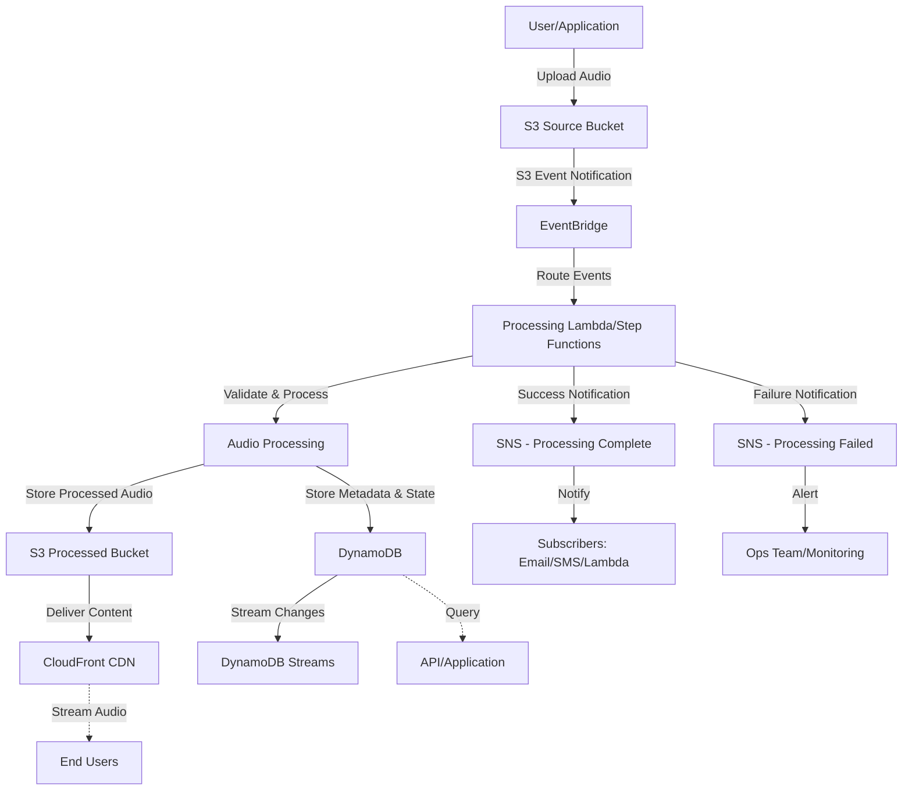

# Sleep Audio Pipeline Architecture

## Overview

This document describes the architecture of the event-driven sleep audio pipeline built on AWS using CDK Go. The system is designed to process sleep audio files through an event-driven architecture, ensuring scalability, reliability, and maintainability following AWS Well-Architected principles.

## Event-Driven Sleep Audio Pipeline

### System Description

The sleep audio pipeline is a fully serverless, event-driven system that processes audio files for sleep-related applications. The pipeline follows these key principles:

- **Event-Driven Architecture**: All components communicate through events, enabling loose coupling and independent scaling
- **Serverless-First**: Utilizing managed AWS services to minimize operational overhead
- **Well-Architected**: Following AWS best practices for security, reliability, performance, cost optimization, and operational excellence

### Pipeline Flow

#### 1. Ingestion Stage

**S3 Source Bucket**
- Raw audio files are uploaded to a designated S3 bucket
- Bucket is configured with versioning and encryption at rest
- Supports various audio formats (MP3, WAV, FLAC, etc.)
- S3 Events are configured to trigger on new object creation

#### 2. Event Routing Stage

**EventBridge**
- S3 events are routed through Amazon EventBridge for flexible event processing
- EventBridge rules filter and route events based on:
  - File type/extension
  - File size
  - Metadata tags
  - Custom event patterns
- Enables multiple downstream consumers without tight coupling
- Provides event replay and archive capabilities for audit and recovery

#### 3. Processing Stage

**Lambda Functions (or Step Functions)**
- **Audio Validation**: Validates audio format, duration, and quality
- **Metadata Extraction**: Extracts metadata (duration, bitrate, codec, etc.)
- **Audio Transcoding**: Converts audio to optimized formats for streaming
- **Audio Analysis**: Analyzes audio characteristics (frequency, amplitude patterns)
- **Quality Assurance**: Ensures audio meets sleep audio quality standards

Processing approach options:
- **Simple Processing**: Direct Lambda invocation for quick, straightforward tasks
- **Complex Workflows**: AWS Step Functions for multi-step, orchestrated processing with error handling and retries

#### 4. Storage and State Management

**S3 Processed Bucket**
- Stores processed/transcoded audio files
- Organized by date, format, and processing status
- Lifecycle policies for archival to Glacier for cost optimization
- CloudFront distribution for global content delivery

**DynamoDB**
- Stores audio metadata and processing state
- Tracks processing status and history
- Enables queries by various dimensions (upload date, status, user, etc.)
- Stores relationships between original and processed files
- DynamoDB Streams for downstream event propagation

#### 5. Notification Stage

**SNS Topics**
- **Processing Complete**: Notifies when audio processing is complete
- **Processing Failed**: Alerts on processing failures for manual intervention
- **Quality Issues**: Notifies when audio doesn't meet quality standards
- Supports multiple subscription types: email, SMS, Lambda, SQS
- Fan-out pattern for multiple consumers

### Cross-Cutting Concerns

#### Security
- All S3 buckets encrypted at rest with KMS
- IAM roles following principle of least privilege
- VPC endpoints for private AWS service communication (where applicable)
- Secrets Manager for sensitive configuration
- CloudTrail logging for audit trail

#### Monitoring and Observability
- CloudWatch Logs for all Lambda functions
- CloudWatch Metrics for custom business metrics
- X-Ray for distributed tracing
- CloudWatch Alarms for critical thresholds
- EventBridge monitoring for event flow visibility

#### Cost Optimization
- S3 Lifecycle policies for intelligent tiering and archival
- Lambda right-sizing based on actual usage patterns
- DynamoDB on-demand or provisioned based on access patterns
- CloudWatch Logs retention policies

## Architecture Diagram

> **Note**: This diagram will be enhanced with AWS-specific icons and more detailed component interactions as the implementation progresses. The diagram will be kept in sync with actual CDK stack implementation.
