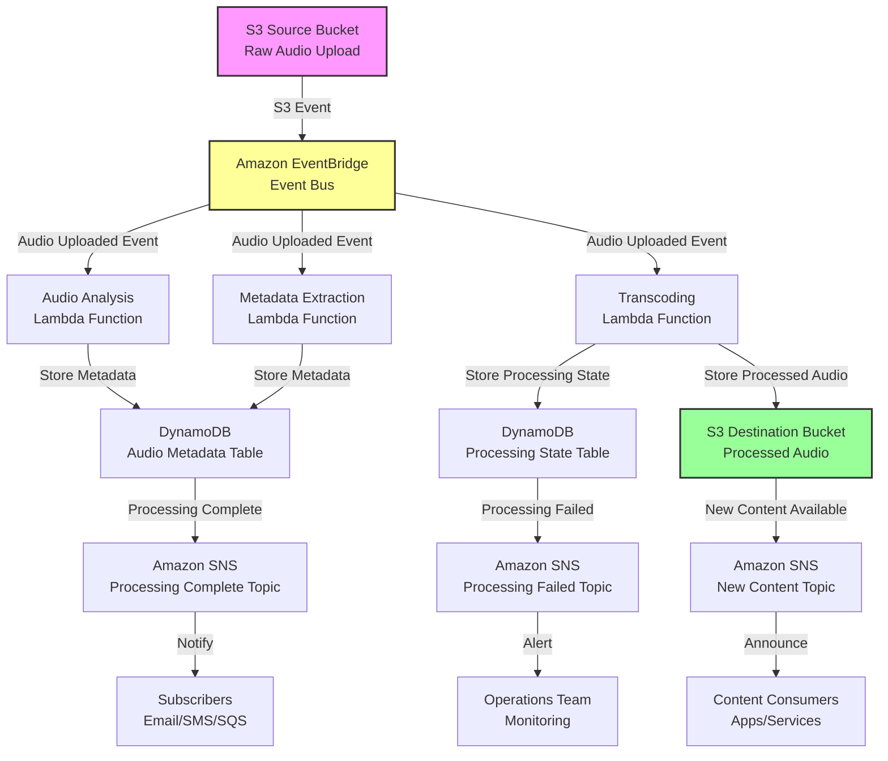

# Sleep Audio Pipeline Architecture

## Overview

The Sleep Audio Pipeline is an event-driven, serverless AWS architecture designed to process, analyze, and deliver personalized sleep audio content. The system leverages AWS native services to create a scalable, resilient, and cost-effective solution following the AWS Well-Architected Framework principles.

## Architecture Description

### Event-Driven Flow

The architecture follows a pure event-driven pattern where each component reacts to events without tight coupling:

1. **Audio Ingestion (S3 Source Bucket)**
   - Raw sleep audio files are uploaded to a designated S3 source bucket
   - S3 Event Notifications trigger the processing pipeline
   - Supports multiple audio formats (MP3, WAV, FLAC, etc.)
   - Implements versioning for audit and recovery

2. **Event Routing (Amazon EventBridge)**
   - S3 events are routed through EventBridge for flexible event handling
   - EventBridge acts as the central event bus for the pipeline
   - Enables complex event pattern matching and filtering
   - Allows multiple downstream consumers without modifying source
   - Supports event replay and debugging capabilities

3. **Audio Processing (AWS Lambda Functions)**
   - **Audio Analysis Lambda**: Analyzes audio properties (duration, quality, frequency analysis)
   - **Metadata Extraction Lambda**: Extracts and enriches metadata (tags, categories, sleep phase suitability)
   - **Transcoding Lambda**: Converts audio to optimized formats for streaming and download
   - **Thumbnail Generation Lambda**: Creates waveform visualizations for UI
   - Each function is independently scalable and idempotent
   - Implements retry logic with exponential backoff
   - Uses Dead Letter Queues (DLQ) for failed processing

4. **Data Persistence (Amazon DynamoDB)**
   - **Audio Metadata Table**: Stores processed audio metadata, tags, and references
   - **Processing State Table**: Tracks pipeline state for each audio file (processing, completed, failed)
   - **User Preferences Table**: Stores user listening preferences and history
   - Uses on-demand capacity for cost optimization
   - Implements TTL for temporary processing state records
   - Point-in-time recovery enabled for data protection

5. **Processed Storage (S3 Destination Bucket)**
   - Stores processed and transcoded audio files
   - Organized by format, quality, and metadata
   - S3 Intelligent-Tiering for automatic cost optimization
   - CloudFront integration ready for content delivery
   - Cross-Region Replication for disaster recovery

6. **Notifications (Amazon SNS)**
   - **Processing Complete Topic**: Notifies when audio processing succeeds
   - **Processing Failed Topic**: Alerts on processing failures for monitoring
   - **New Content Topic**: Announces new available content to subscribers
   - Supports multiple subscription protocols (email, SMS, SQS, Lambda)
   - Message filtering for targeted notifications

### AWS Well-Architected Considerations

- **Operational Excellence**: Full infrastructure as code with AWS CDK, automated testing
- **Security**: Least privilege IAM roles, encryption at rest and in transit, VPC endpoints where applicable
- **Reliability**: Multi-AZ deployment, DLQ for failed messages, idempotent processing
- **Performance Efficiency**: Serverless auto-scaling, optimized Lambda memory configurations
- **Cost Optimization**: Pay-per-use pricing, S3 lifecycle policies, DynamoDB on-demand
- **Sustainability**: Serverless reduces idle resource consumption

## Architecture Diagram

This architecture serves as the foundation for all future development. Every code change must maintain alignment with this design and update this diagram as needed.
