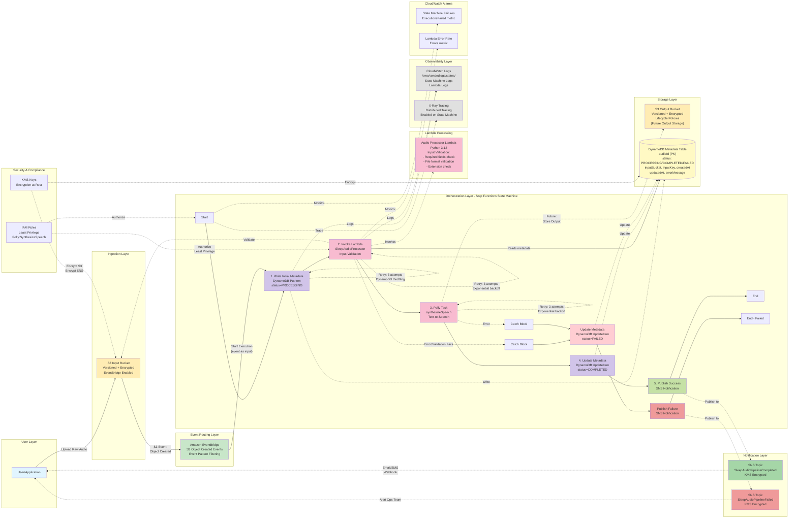

# Sleep Audio Pipeline Architecture

> 🔬 **Experiment Documentation**: This architecture is part of a TDD IaC experiment. For comprehensive methodology, prompting patterns, and lessons learned, see [EXPERIMENT.md](./EXPERIMENT.md).

## Overview

This document serves as the **source of truth** for the event-driven sleep audio pipeline built on AWS using CDK Go. The system is designed to process sleep-related audio files through a fully serverless, event-driven architecture, ensuring scalability, reliability, security, and maintainability while following AWS Well-Architected principles.

This is a living document that will evolve alongside the implementation. All architectural decisions, component interactions, and design rationale are documented here.

**Related Documentation**: See [README.md](./README.md) for project overview, [META-PROMPTS.md](./META-PROMPTS.md) for reusable patterns, and [SUMMARY.md](./SUMMARY.md) for project statistics.

## System Description

The sleep audio pipeline is a production-grade, fully serverless system that enables users to upload raw audio files (voice recordings, ambient sounds, meditation guides) and automatically processes them into high-quality sleep audio content. The system leverages AI services like Amazon Polly for text-to-speech generation and AWS Bedrock for AI-enhanced audio content.

### Key Principles

- **Event-Driven Architecture**: All components communicate asynchronously through events, enabling loose coupling, independent scaling, and resilient operations
- **Serverless-First**: Leverages fully managed AWS services to eliminate infrastructure management overhead
- **Security by Design**: Implements least-privilege IAM roles, encryption at rest and in transit, and private networking
- **Observable and Auditable**: Comprehensive logging, metrics, alarms, and distributed tracing for operational excellence
- **Multi-Environment**: Supports dev, stage, and prod environments with consistent configuration management via CDK context
- **Well-Architected**: Adheres to all six pillars of the AWS Well-Architected Framework
- **Cost-Optimized**: Intelligent resource sizing, lifecycle policies, and pay-per-use pricing models

## Architecture Diagram



## End-to-End Pipeline Flow

### Success Path

1. **User Upload**: User uploads an audio file (e.g., `sleep-story.mp3`, `meditation.txt`) to the S3 Input Bucket

2. **S3 Event Trigger**: S3 bucket (with EventBridge enabled) emits an `Object Created` event containing:
   - Bucket name
   - Object key (file path)
   - Event time
   - Additional metadata

3. **EventBridge Routing**: EventBridge rule filters events matching pattern:
   - Source: `aws.s3`
   - Detail Type: `Object Created`
   - Bucket name matches input bucket
   - Rule triggers Step Functions state machine execution

4. **State Machine Execution Begins**: Step Functions receives the S3 event as input

5. **Step 1 - Write Initial Metadata** (DynamoDB):
   - Uses `CallAwsService` task to invoke `dynamodb:PutItem`
   - Creates metadata record with:
     - `audioId`: Object key from S3 event
     - `status`: `"PROCESSING"`
     - `inputBucket`: Bucket name
     - `inputKey`: Object key
     - `createdAt`: State machine entry timestamp

6. **Step 2 - Lambda Validation** (Audio Processor):
   - State machine invokes Lambda function with event details
   - Lambda performs **input validation**:
     - **Required Fields Check**: Validates bucket and audioId are present
     - **Bucket Name Validation**: Checks bucket name length (3-63 chars)
     - **File Extension Validation**: Ensures file ends with supported format (`.mp3`, `.wav`, `.m4a`, `.flac`, `.ogg`, `.txt`)
     - **Returns**: Validation result with file format metadata
  - **Retry Policy (Issue #10)**:
    - Error types: `Lambda.ServiceException`, `Lambda.TooManyRequestsException`, `States.TaskFailed`
    - Max attempts: 3
    - Initial interval: 2 seconds
    - Backoff rate: 2.0 (exponential backoff: 2s, 4s, 8s)
  - **Error Handling (Issue #10)**:
    - Catches all error types (`States.ALL`)
    - Error details stored in `$.Error` for DynamoDB update
    - Routes to failure path: Update DynamoDB status → Publish SNS notification
   - If validation fails: Lambda raises exception → Step Functions catches error → Routes to failure path

7. **Step 3 - Polly Text-to-Speech** (AWS Polly):
  - **Retry Policy (Issue #10)**:
    - Error types: `Polly.EngineNotSupportedException`, `Polly.ServiceFailureException`, `States.TaskFailed`
    - Max attempts: 3
    - Initial interval: 2 seconds
    - Backoff rate: 2.0 (exponential backoff)
  - **Error Handling (Issue #10)**:
    - Catches all error types with specific error identification
    - Routes to failure path on any error

8. **DynamoDB Operations - Retry Policies** (Issue #10):
  All DynamoDB tasks (PutItem, UpdateItem) have retry configured:
  - **Error types**: 
    - `States.TaskFailed` - General task failures
    - `DynamoDB.ProvisionedThroughputExceededException` - Throttling
    - `DynamoDB.RequestLimitExceeded` - Rate limiting
  - **Max attempts**: 3
  - **Initial interval**: 2 seconds
  - **Backoff rate**: 2.0 (exponential: 2s, 4s, 8s)
  - **Why**: Handles transient failures, throttling during high load, eventual consistency issues

7. **Step 3 - Polly Text-to-Speech** (AWS Polly):
  - Uses `CallAwsService` task to invoke `polly:SynthesizeSpeech`
   - Uses `CallAwsService` task to invoke `polly:SynthesizeSpeech`
   - Currently a placeholder implementation with static parameters
   - Parameters:
     - Text: Placeholder string
     - VoiceId: "Joanna" (neural voice)
     - OutputFormat: "mp3"
     - Engine: "neural"
   - Result stored in `$.pollyResult`
   - If Polly fails: Step Functions catches error → Routes to failure path

8. **Step 4 - Update Metadata to COMPLETED** (DynamoDB):
  - Error Handling (Issue #10): Enhanced catch blocks with specific error types
    - Identifies Lambda.ServiceException, States.TaskFailed, DynamoDB errors, Polly errors
   - Uses `CallAwsService` task to invoke `dynamodb:UpdateItem`
   - Updates metadata record:
     - `status`: `"COMPLETED"`
     - `updatedAt`: State machine entry timestamp

9. **Step 5 - Publish Success Notification** (SNS):
   - Uses `CallAwsService` task to invoke `sns:Publish`
   - Publishes to `SleepAudioPipelineCompleted` topic (KMS encrypted)
   - Message: "Pipeline completed successfully for audioId: {audioId}"
   - Subject: "Sleep Audio Pipeline Completed"

10. **State Machine Completes**: Execution ends with `SUCCEEDED` status

### Failure/Error Path

Error handling is implemented at two key points: Lambda validation and Polly task.

**Trigger Points**:
- **Lambda Validation Failure**: Invalid input (missing fields, unsupported format, invalid bucket)
- **Lambda Processing Error**: Unexpected exceptions during processing
- **Polly Task Failure**: Polly API errors, throttling, invalid parameters

**Error Handling Flow**:

1. **Catch Block Triggered**: Step Functions catches exception from Lambda or Polly task
   - Error details captured in `$.Error` result path

2. **Update Metadata to FAILED** (DynamoDB):
   - Uses `CallAwsService` task to invoke `dynamodb:UpdateItem`
   - Updates metadata record:
     - `status`: `"FAILED"`
     - `updatedAt`: State machine entry timestamp
     - `errorMessage`: Error details from `$.Error`

3. **Publish Failure Notification** (SNS):
   - Uses `CallAwsService` task to invoke `sns:Publish`
   - Publishes to `SleepAudioPipelineFailed` topic (KMS encrypted)
   - Message: "Pipeline failed for audioId: {audioId} with error: {error}"
   - Subject: "Sleep Audio Pipeline Failed"

4. **State Machine Completes**: Execution ends (error handled gracefully)

### Validation Points

The pipeline implements **defense-in-depth validation** at multiple layers:

#### 1. EventBridge Layer Validation
- **Event Pattern Filtering**: Only processes events matching specific source and detail-type
- **Bucket Name Filtering**: Only triggers for configured input bucket
- Prevents unnecessary state machine executions

#### 2. Lambda Function Input Validation

**Required Fields Validation**:
```python
if not bucket or not audio_id:
    raise ValidationError("Missing required fields: bucket and audioId are required")
```

**Bucket Name Validation**:
```python
if len(bucket) < 3 or len(bucket) > 63:
    raise ValidationError(f"Invalid bucket name: {bucket}")
```

**File Format Validation**:
```python
SUPPORTED_AUDIO_FORMATS = ['.mp3', '.wav', '.m4a', '.flac', '.ogg', '.txt']
if not any(audio_id.lower().endswith(ext) for ext in SUPPORTED_AUDIO_FORMATS):
    raise ValidationError(f"Unsupported file format")
```

**Error Response**: Validation errors raise exceptions that are caught by Step Functions error handling, routing to the failure path
**Structured Logging (Issue #10)**: Lambda outputs JSON-formatted logs with request IDs, status, error context


#### 3. State Machine Error Handling
- **Catch Blocks**: Both Lambda and Polly tasks have catch blocks
- **Error Routing**: Errors automatically route to failure path (DynamoDB update + SNS notification)
- **Error Preservation**: Error details stored in DynamoDB for debugging

#### 4. IAM Permission Boundaries (Least Privilege)
- Each service has minimal required permissions
- Explicit deny on unauthorized actions
- Resource-level restrictions where applicable

### Data Flow and Transformations

**Initial Input** (from S3 event):
```json
{
  "detail": {
    "bucket": {"name": "sleep-audio-input-bucket"},
    "object": {"key": "user-uploads/meditation.mp3"}
  }
}
```

**After Lambda Processing** (`$.processorResult.Payload`):
```json
{
  "statusCode": 200,
  "valid": true,
  "audioId": "user-uploads/meditation.mp3",
  "bucket": "sleep-audio-input-bucket",
  "format": ".mp3",
  "status": "processed",
  "message": "Audio validation and processing completed successfully"
}
```

**After Polly Task** (`$.pollyResult`):
```json
{
  "AudioStream": "<binary data>",
  "ContentType": "audio/mpeg",
  "RequestCharacters": 123
}
```

**Error Flow** (on validation failure):
```json
{
  "Error": "ValidationError: Unsupported file format. audioId must end with one of: .mp3, .wav, .m4a, .flac, .ogg, .txt"
}
```

## Detailed Component Description

### 1. Ingestion Layer

#### S3 Input Bucket

**Purpose**: Entry point for all raw audio files uploaded by users or applications.

**Configuration**:
- **Versioning**: Enabled to preserve file history and support rollback
- **Encryption**: Server-side encryption using AWS KMS with customer-managed keys
- **Access Control**: Private bucket with no public access; access via pre-signed URLs or IAM roles only
- **Event Notifications**: Configured to send S3 events to EventBridge on `s3:ObjectCreated:*` events
- **Supported Formats**: MP3, WAV, FLAC, M4A, OGG, and raw text files for TTS generation
- **Size Limits**: Configurable via CDK context (default: 100MB per file)
- **Lifecycle Policies**: Optional transition to Glacier after 90 days for cost optimization

**Why S3?**
- Highly durable (99.999999999% durability)
- Scalable to handle any number of concurrent uploads
- Native integration with EventBridge
- Cost-effective storage with intelligent tiering

### 2. Event Routing Layer

#### Amazon EventBridge

**Purpose**: Decouples event producers from consumers, providing flexible event routing and filtering.

**Configuration**:
- **Event Bus**: Custom event bus for sleep audio pipeline events
- **Event Rules**: Filter events based on:
  - File extension (`.mp3`, `.wav`, `.txt`, etc.)
  - File size (skip files that are too large or too small)
  - Metadata tags (priority processing, user tier)
  - Custom event patterns for advanced routing
- **Targets**: Routes to Step Functions state machine for orchestrated processing
- **Archive**: Optionally archive events for replay and debugging (configurable retention)
- **DLQ**: Dead-letter queue for failed event deliveries

**Why EventBridge?**
- Schema registry for event structure validation
- Event replay capabilities for recovery scenarios
- Enables future integrations without modifying existing components
- Built-in filtering reduces unnecessary Lambda invocations
- Provides event archive for audit and compliance

### 3. Processing Layer

#### Lambda Function - Audio Processor

**Purpose**: Validates input, enriches metadata, and prepares audio files for processing.

**Current Implementation (Issue #8)**:

**Input Validation Logic**:
1. **Required Fields Check**: Ensures bucket and audioId are present
2. **Bucket Name Validation**: Validates S3 bucket name format (3-63 characters)
3. **File Extension Validation**: Checks file ends with supported format
4. **Error Handling**: Raises exceptions for invalid input, caught by Step Functions

**Configuration**:
- **Runtime**: Python 3.12
- **Handler**: `handler.lambda_handler`
- **Memory**: 256 MB
- **Timeout**: 30 seconds
- **Environment Variables**: `METADATA_TABLE_NAME` (for DynamoDB access)
- **IAM Permissions**: Read access to S3 input bucket, read/write to DynamoDB table
- **X-Ray Tracing (Issue #10)**: Active tracing enabled for distributed tracing
- **Structured Logging (Issue #10)**: JSON-formatted logs with request IDs, status, error details
  - Log format: `{"message": "...", "level": "INFO/ERROR", "request_id": "...", "audio_id": "...", "status": "..."}`
  - Enables efficient CloudWatch Logs Insights queries

#### AWS Step Functions State Machine

**Purpose**: Orchestrates multi-step audio processing workflow with error handling, retries, and parallel execution.

**Current Implementation (Issues #4-8 - Complete Basic Pipeline)**:

**Current Implementation (Issues #4-6)**:
   - Direct service integration using Step Functions' `CallAwsService` task
The state machine currently implements:

1. **DynamoDB Write Initial Metadata** (AWS Service Integration - Issue #5)
   - Writes initial record with status = "PROCESSING"
   - Stores audioId, inputBucket, inputKey, createdAt timestamp
   - Uses JSON path expressions to extract data from S3 event

2. **Lambda Invocation** (LambdaInvoke task - Issue #7, #8)
   - Invokes Audio Processor Lambda for validation and processing
   - Passes S3 event details as payload
   - **Error Handling**: Catch block routes validation failures to failure path
   - Result stored in `$.processorResult`

3. **Polly Task** (AWS Service Integration - Issue #4)
   - Placeholder implementation for text-to-speech synthesis
     - Text: "This is a placeholder for sleep audio generation"
     - VoiceId: "Joanna" (neural voice)
     - OutputFormat: "mp3"
     - Engine: "neural"
   - IAM permissions: `polly:SynthesizeSpeech` (least privilege)
   - Result stored in `$.pollyResult` for future processing steps
   - **Error Handling**: Catch block routes Polly failures to failure path

4. **DynamoDB Update Metadata - Success Path** (Issue #5, #8)
   - Updates status to "COMPLETED" with timestamp
   - Only executes if all previous tasks succeed

5. **SNS Publish Success** (Issue #6, #8)
   - Publishes notification to completion topic
   - Includes audioId in message
   - Uses `States.Format` for dynamic message generation

**Error Handling Path** (Issue #6, #8):

6. **DynamoDB Update Metadata - Failure Path** (triggered by Catch blocks)
   - Updates status to "FAILED" with timestamp and error details
   - Triggered by Catch block on Polly task errors
   - Stores error message from `$.Error`

7. **SNS Publish Failure** (follows failure DynamoDB update)
   - Publishes notification to failure topic
   - Includes audioId and error message

**Future Processing Steps** (Planned for subsequent issues):
1. **Enhanced Polly Integration** (Lambda)
   - **Use Case**: AI-enhanced audio generation for ambient sleep sounds, soundscapes
   - **Models**: Leverages foundation models for:
     - Generating natural soundscapes (rain, ocean waves, forest ambience)
     - Audio enhancement (noise reduction, frequency balancing)
     - Personalized audio mixing based on user preferences
   - **Prompt Engineering**: Structured prompts for consistent, high-quality outputs
   - **Output Processing**: Validates and normalizes AI-generated audio
   - **Fallback Logic**: Falls back to Polly or pre-generated sounds if Bedrock is unavailable

2. **Transcoding/Optimization Step** (Lambda)
5. **Transcoding/Optimization Step** (Lambda)
   - Converts audio to optimized formats for streaming (e.g., AAC, Opus)
   - Normalizes audio levels for consistent volume
   - Applies compression for reduced file size without quality loss
   - Creates multiple quality tiers (high/medium/low bitrate)
   - Generates waveform images for UI visualization

**Configuration**:
- **CloudWatch Logs**: All execution logs sent to dedicated log group (`/aws/vendedlogs/states/SleepAudioPipeline`)
  - Retention: 7 days
  - Log Level: ALL (includes input/output of each state)
- **X-Ray Tracing**: Enabled for distributed tracing and performance analysis
- **IAM Least Privilege**: State machine execution role has minimal permissions:
  - `dynamodb:PutItem`, `dynamodb:UpdateItem` on metadata table
  - `polly:SynthesizeSpeech` (all resources)
  - `sns:Publish` on success/failure topics
  - `lambda:InvokeFunction` on audio processor function
- **Standard Workflow**: Using Standard (not Express) for audit trail and visual monitoring
- **Timeout**: 5 minutes (prevents hung executions)
- **Tracing**: Enabled for full distributed tracing
- **Tracing**: X-Ray enabled for full distributed tracing (Issue #10)

**Issue #10 Enhancements - Advanced Error Handling & Retry Policies**:

**Why Step Functions?**
- Visual workflow design and monitoring
- Built-in retry and error handling
- Long-running workflows (up to 1 year)
- Automatic state management and checkpointing
- Declarative workflow definition with no orchestration boilerplate

**Current Limitations (To Be Addressed in Future Issues)**:
**Completed Features (Issue #8)**:
- ✅ Complete end-to-end pipeline wiring
- ✅ Input validation in Lambda
- ✅ Error handling with Catch blocks
- ✅ DynamoDB status tracking (PROCESSING → COMPLETED/FAILED)
- ✅ SNS notifications (success and failure paths)
- ✅ Least-privilege IAM across all components
### Alternative: Lambda-Only Processing

For simple, single-step processing, direct Lambda invocation from EventBridge is an option:
- **Pros**: Lower latency, simpler architecture, lower cost for basic workflows
- **Cons**: Manual error handling, no visual workflow, limited orchestration
- **Use Case**: When processing is a single, atomic operation (e.g., simple format conversion)

### 4. Storage Layer

#### S3 Output Bucket

**Purpose**: Stores all processed, production-ready audio files.

**Configuration**:
- **Versioning**: Enabled to track file history and support rollbacks
- **Encryption**: Server-side encryption using AWS KMS with customer-managed keys
- **Access Control**: Private bucket with CloudFront OAI for content delivery
- **Directory Structure**: Organized by date, user, and processing status:
  ```
  /processed/YYYY/MM/DD/user_id/audio_id.mp3
  /processed/YYYY/MM/DD/user_id/audio_id_metadata.json
  ```
- **Lifecycle Policies**:
  - Transition to Intelligent-Tiering after 30 days
  - Archive to Glacier after 90 days for infrequently accessed content
  - Expire old versions after 180 days
- **CORS Configuration**: Allows browser-based audio streaming from approved domains
- **CloudFront Distribution**: CDN for global, low-latency content delivery

#### DynamoDB Table

**Purpose**: Stores audio file metadata, processing state, and relationships.

**Schema Design**:
- **Primary Key**: `audio_id` (UUID, partition key)
- **Sort Key**: `version` (integer, for versioning support)
- **Attributes**:
  - `user_id`: User who uploaded the file
  - `original_file_key`: S3 key of original file
  - `processed_file_key`: S3 key of processed file
  - `status`: `PENDING`, `PROCESSING`, `COMPLETED`, `FAILED`
  - `duration_seconds`: Audio duration
  - `format`: Audio format (MP3, WAV, etc.)
  - `bitrate`: Audio bitrate
  - `sample_rate`: Sample rate (Hz)
  - `processing_started_at`: ISO 8601 timestamp
  - `processing_completed_at`: ISO 8601 timestamp
  - `error_message`: Error details if status is FAILED
  - `metadata_json`: Additional metadata as JSON
- **Global Secondary Indexes (GSI)**:
  - `user_id-status-index`: Query by user and status
  - `status-processing_started_at-index`: Query by status and time for monitoring
  - `created_at-index`: Time-based queries for analytics
- **DynamoDB Streams**: Enabled for downstream event propagation (future integrations)
- **Point-in-Time Recovery**: Enabled for data protection
- **Encryption**: Encrypted at rest using AWS-managed KMS keys
- **Billing Mode**: On-demand for unpredictable workloads, provisioned with auto-scaling for predictable patterns

**Why DynamoDB?**
- Single-digit millisecond latency at any scale
- Fully managed with automatic scaling
- Built-in support for streams (event-driven patterns)
- Cost-effective for variable workloads with on-demand billing

### 5. Notification Layer

#### SNS Topics

**Purpose**: Asynchronous notifications for processing results and operational alerts.

**Topics**:

1. **Processing Success Topic**
   - **Subscribers**: User notification service, analytics service, monitoring dashboard
   - **Message Format**: JSON with audio_id, user_id, processed_file_url, duration, format
1. **Processing Success Topic** (`SleepAudioPipelineCompleted` - Issue #6)
   - **Topic Name**: `SleepAudioPipelineCompleted`
   - **Encryption**: KMS customer-managed key with rotation enabled
   - **Message Format**: Plain text with audioId (formatted by Step Functions)
   - **Triggered By**: Step Functions state machine on successful completion
   - **Current Subscribers**: None (configured externally)
   - **Future Subscribers**: 
     - User notification Lambda (email/SMS)
     - Analytics/monitoring dashboard
     - Webhook to external systems

2. **Processing Error Topic**
   - **Subscribers**: Operations team email/SMS, PagerDuty, CloudWatch alarm actions
   - **Encryption**: KMS encryption with dedicated key
   - **Message Format**: JSON with audio_id, user_id, error_type, error_message, stack_trace
2. **Processing Error Topic** (`SleepAudioPipelineFailed` - Issue #6)
   - **Topic Name**: `SleepAudioPipelineFailed`
   - **Encryption**: KMS customer-managed key with rotation enabled
   - **Message Format**: Plain text with audioId and error details
   - **Triggered By**: Step Functions state machine on failure (Lambda validation or Polly errors)
   - **Current Subscribers**: None (configured externally)
   - **Future Subscribers**:
     - Operations team email/SMS
     - PagerDuty integration
     - CloudWatch alarm actions

**Configuration**:
- **Encryption**: In-transit and at-rest encryption
   - **Encryption**: KMS encryption with dedicated key
- **Access Policy**: Least-privilege IAM policies
- **DLQ**: Dead-letter queue for failed message deliveries
- **Message Filtering**: Subscription filters for targeted notifications
- **Fan-Out Pattern**: Single SNS topic can trigger multiple Lambda functions, SQS queues, HTTP endpoints

## Cross-Cutting Concerns

### Security Architecture

**Encryption**:
- **At Rest**: All S3 buckets and DynamoDB tables encrypted using AWS KMS customer-managed keys (CMKs)
- **In Transit**: All data transfer uses TLS 1.2+ (enforced via bucket policies and IAM conditions)
- **Key Management**: Separate KMS keys per environment (dev/stage/prod) with automatic rotation enabled

**IAM and Access Control**:
- **Least Privilege Principle**: Each Lambda function has a dedicated IAM role with minimal permissions
- **Resource-Based Policies**: S3 buckets explicitly deny public access, allow only specific IAM roles
- **Service Control Policies (SCP)**: Organization-level guardrails (if using AWS Organizations)
- **No Hardcoded Credentials**: All API keys/tokens stored in AWS Secrets Manager, retrieved at runtime
- **Cross-Service Permissions**: EventBridge, Step Functions, Lambda have explicit trust relationships

**Network Security**:
- **Private Buckets**: No public internet access; access via CloudFront OAI or VPC endpoints
- **VPC Endpoints** (Optional): PrivateLink endpoints for S3, DynamoDB, Secrets Manager for private network access
- **Security Groups/NACLs**: If VPC is used, strict ingress/egress rules

**Secrets Management**:
- **AWS Secrets Manager**: Stores API keys for Bedrock, third-party services
- **Automatic Rotation**: Secrets auto-rotate every 30-90 days
- **Version Tracking**: Previous versions retained for rollback
- **Access Auditing**: CloudTrail logs all secret retrievals

**Audit and Compliance**:
- **AWS CloudTrail**: Logs all API calls for audit trail (90-day retention, longer in S3)
- **S3 Access Logs**: Server access logging for both input and output buckets
- **DynamoDB Streams**: Captures all table changes for audit
- **AWS Config**: Tracks resource configuration changes over time

### Observability and Monitoring
#### CloudWatch Alarms (Issue #10)

**State Machine Execution Failures Alarm**:
- **Metric**: `AWS/States` namespace, `ExecutionsFailed` metric
- **Threshold**: ≥ 1 failed execution
- **Evaluation Period**: 5 minutes
- **Purpose**: Immediate alert on any state machine execution failure
- **Action**: Can be configured to trigger SNS topic for operations team

**Lambda Error Rate Alarm**:
- **Metric**: `AWS/Lambda` namespace, `Errors` metric
- **Threshold**: ≥ 5 errors
- **Evaluation Period**: 5 minutes
- **Purpose**: Alert on high Lambda error rates indicating systematic issues
- **Action**: Triggers investigation of Lambda function errors

**Additional Recommended Alarms** (Future):
- DynamoDB throttling alarms
- SNS topic delivery failures
- Lambda duration exceeding timeout
- Cost budget alarms

#### Retry Policies (Issue #10)

All critical tasks have exponential backoff retry policies configured to handle transient failures gracefully without manual intervention. See individual task descriptions above for specific retry configurations.

#### Logging

**Logging**:
- **CloudWatch Logs**: All Lambda functions log to dedicated log groups with structured JSON logs
- **Log Retention**: Configurable per environment (7 days dev, 30 days stage, 90 days prod)
- **Log Insights**: Custom queries for troubleshooting and analytics
- **Step Functions Execution History**: Detailed state transition logs

**Metrics**:
- **Standard Metrics**: Lambda duration, invocation count, error count, concurrent executions
- **Custom Business Metrics**: Processing time per step, file size distributions, user activity
- **DynamoDB Metrics**: Read/write capacity, throttled requests, latency
- **S3 Metrics**: Request metrics, data transfer, error rates
- **EventBridge Metrics**: Event delivery success/failure, rule invocation count

**Alarms**:
- **Error Rate Alarms**: Trigger when Lambda error rate exceeds threshold (e.g., >5% in 5 minutes)
- **Duration Alarms**: Alert when processing takes longer than expected
- **DLQ Alarms**: Notify when messages land in dead-letter queues
- **Cost Alarms**: Alert when spending exceeds budget thresholds
- **DynamoDB Throttling**: Alarm on throttled requests

**Distributed Tracing**:
- **AWS X-Ray**: Enabled on all Lambda functions and Step Functions
- **Service Map**: Visualizes component dependencies and bottlenecks
- **Trace Analysis**: Identifies slow operations and error patterns
- **Sampling**: Configurable sampling rate to control costs (e.g., 10% in prod, 100% in dev)
- **Lambda Function**: Active tracing mode with custom annotations
- **State Machine**: Tracing enabled for end-to-end visibility
- **Annotations**: Request IDs, audio IDs for easy filtering
- **Metadata**: Input parameters, validation results, error details

**Structured Logging (Issue #10)**:
- JSON-formatted logs from Lambda functions
- Includes: request_id, function_name, audio_id, bucket, status, error details
- Enables powerful CloudWatch Logs Insights queries

### Cost Optimization

**Storage Costs**:
- S3 Intelligent-Tiering automatically moves data between access tiers
- Lifecycle policies transition old files to Glacier ($0.004/GB vs $0.023/GB Standard)
- S3 versioning with expiration policies prevent unbounded growth
- CloudWatch Logs retention policies (7-90 days)

**Compute Costs**:
- Lambda: Right-size memory based on profiling (more memory = faster = cheaper)
- Lambda: Use ARM64 (Graviton2) for 20% cost savings where compatible
- Step Functions: Standard workflows for long-running, Express for high-volume/short-duration
- Polly: Cache commonly generated phrases, use standard voices where appropriate
- Bedrock: Batch requests where possible, implement request caching

**Database Costs**:
- DynamoDB: On-demand for dev/stage (unpredictable), provisioned with auto-scaling for prod
- DynamoDB: Use sparse indexes to reduce index costs
- DynamoDB: Archive old items to S3 via DynamoDB Streams + Lambda

**Network Costs**:
- CloudFront for content delivery reduces S3 data transfer costs
- VPC endpoints eliminate NAT Gateway data transfer costs (if using VPC)

**Monitoring Costs**:
- CloudWatch: Use metric filters instead of custom metrics where possible
- X-Ray: Sample traces (10%) in production to reduce costs
- Log aggregation: Ship logs to S3 for long-term storage (cheaper than CloudWatch Logs)

### Multi-Environment Support
## Deployment and CI/CD Architecture (Issue #9)

### Deployment Pipeline Overview

The Sleep Audio Pipeline uses AWS CDK Pipelines for automated, multi-environment deployment with built-in testing and approval workflows.

**Pipeline Diagram:**

```mermaid
flowchart LR
    subgraph Source["Source Stage"]
        GH[GitHub Repository<br/>Main Branch]
    end
    
    subgraph Build["Build Stage"]
        SYNTH[CDK Synth<br/>Run Tests<br/>Generate CloudFormation]
    end
    
    subgraph SelfMutate["Self-Mutation"]
        UPDATE[Update Pipeline<br/>Self-Modifying]
    end
    
    subgraph DevDeploy["Dev Deployment"]
        DEV_STACK[Deploy to Dev<br/>Account: 111111111111<br/>Region: us-east-1]
        DEV_TEST[Post-Deploy Tests<br/>Smoke Tests]
    end
    
    subgraph StageDeploy["Stage Deployment"]
        STAGE_STACK[Deploy to Stage<br/>Account: 111111111111<br/>Region: us-east-1]
        STAGE_TEST[Integration Tests<br/>Load Tests]
    end
    
    subgraph ProdApproval["Production Approval"]
        MANUAL[Manual Approval<br/>Required]
    end
    
    subgraph ProdDeploy["Production Deployment"]
        PROD_STACK[Deploy to Prod<br/>Account: 222222222222<br/>Region: us-east-1]
        PROD_MONITOR[Post-Deploy Monitoring<br/>CloudWatch Alarms]
    end
    
    GH --> SYNTH
    SYNTH --> UPDATE
    UPDATE --> DEV_STACK
    DEV_STACK --> DEV_TEST
    DEV_TEST --> STAGE_STACK
    STAGE_STACK --> STAGE_TEST
    STAGE_TEST --> MANUAL
    MANUAL -->|Approved| PROD_STACK
    PROD_STACK --> PROD_MONITOR
    
    style GH fill:#e1f5ff
    style SYNTH fill:#c8e6c9
    style UPDATE fill:#fff9c4
    style DEV_STACK fill:#bbdefb
    style STAGE_STACK fill:#c5cae9
    style MANUAL fill:#ffcc80
    style PROD_STACK fill:#c8e6c9
```



### Environment Configuration

**Environment-Specific Settings** (from `cdk.json`):

| Configuration | Dev | Stage | Prod |
|--------------|-----|-------|------|
| **Account ID** | 111111111111 | 111111111111 | 222222222222 |
| **Region** | us-east-1 | us-east-1 | us-east-1 |
| **Log Retention** | 7 days | 14 days | 90 days |
| **X-Ray Sampling** | 100% (1.0) | 50% (0.5) | 10% (0.1) |
| **DynamoDB Billing** | PAY_PER_REQUEST | PAY_PER_REQUEST | PAY_PER_REQUEST |
| **State Machine Timeout** | 5 minutes | 5 minutes | 10 minutes |
| **Lambda Memory** | 256 MB | 256 MB | 512 MB |
| **Lambda Timeout** | 30 seconds | 30 seconds | 60 seconds |

### Resource Naming Strategy (Issue #9)

All resources follow environment-specific naming conventions for clear identification and cost allocation:

**Pattern**: `{base-name}-{environment}`

**Examples**:
- **Dev Environment**:
  - S3 Buckets: `sleep-audio-input-dev`, `sleep-audio-output-dev`
  - DynamoDB Table: `SleepAudioMetadataTable-dev`
  - Lambda Function: `SleepAudioProcessor-dev`
  - State Machine: `SleepAudioPipelineStateMachine-dev`

- **Prod Environment**:
  - S3 Buckets: `sleep-audio-input-prod`, `sleep-audio-output-prod`
  - DynamoDB Table: `SleepAudioMetadataTable-prod`
  - Lambda Function: `SleepAudioProcessor-prod`
  - State Machine: `SleepAudioPipelineStateMachine-prod`

### Resource Tagging Strategy

All resources are tagged for cost allocation, governance, and automation:

- `Environment`: dev | stage | prod
- `Project`: SleepAudioPipeline
- `ManagedBy`: CDK
- `CostCenter`: Engineering (from context)


**Environment Separation**:
- **Dev**: Rapid iteration, lower cost, relaxed security for testing
- **Stage**: Production-like for integration testing, scaled-down capacity
- **Prod**: Full scale, maximum security, high availability

**CDK Context Configuration**:
```json
{
  "dev": {
    "account": "111111111111",
    "region": "us-east-1",
    "inputBucketName": "sleep-audio-input-dev",
    "outputBucketName": "sleep-audio-output-dev",
    "dynamoDbBillingMode": "PAY_PER_REQUEST",
    "logRetentionDays": 7,
    "enableXRay": true,
    "xraySamplingRate": 1.0
  },
  "prod": {
    "account": "222222222222",
    "region": "us-east-1",
    "inputBucketName": "sleep-audio-input-prod",
    "outputBucketName": "sleep-audio-output-prod",
    "dynamoDbBillingMode": "PROVISIONED",
    "logRetentionDays": 90,
    "enableXRay": true,
    "xraySamplingRate": 0.1
  }
}
```

**Resource Naming Convention**:
- Pattern: `{service}-{purpose}-{environment}`
- Example: `sleep-audio-input-prod`, `sleep-audio-processor-dev`
- Enables easy identification and cost allocation

**Deployment Strategy**:
- Deploy to dev first for smoke testing
- Promote to stage for integration and load testing
- Blue/green deployment to prod with gradual traffic shifting
- Rollback capability via CloudFormation stack updates

## Future Extensibility
### Deployment Commands

**Deploy to specific environment:**
```bash
# Deploy to dev
cdk deploy --context environment=dev

# Deploy to stage
cdk deploy --context environment=stage

# Deploy to prod
cdk deploy --context environment=prod
```

**Synthesize CloudFormation for specific environment:**
```bash
cdk synth --context environment=prod
```

**View changes before deployment:**
```bash
cdk diff --context environment=prod
```

### CDK Pipeline Deployment (Automated CI/CD)

**Initial Pipeline Setup:**
```bash
# Deploy the pipeline stack (one-time setup)
cdk deploy PipelineStack
```

**Subsequent Deployments:**
- Push code to `main` branch
- Pipeline automatically:
  1. Synthesizes CDK app
  2. Runs tests
  3. Deploys to dev
  4. Deploys to stage
  5. Waits for manual approval
  6. Deploys to prod (after approval)


### Planned Enhancements

1. **Real-Time Processing**: Integrate Amazon Kinesis for streaming audio processing
2. **ML-Powered Personalization**: Train custom ML models using SageMaker for personalized audio recommendations
3. **Multi-Region Deployment**: Global deployment with Route 53 for latency-based routing
4. **API Gateway**: RESTful API for programmatic access to pipeline operations
5. **GraphQL API**: AppSync for real-time subscriptions and mutations
6. **Advanced Analytics**: Integrate with Amazon QuickSight for business intelligence dashboards
7. **Content Moderation**: Integrate Amazon Rekognition Audio or third-party services for content safety
8. **User Authentication**: Cognito integration for user management and access control
9. **Batch Processing**: Support for bulk uploads via S3 Batch Operations
10. **Cost Attribution**: Detailed cost tracking per user/organization using AWS Cost Allocation Tags

### Extensibility Points

- **EventBridge Rules**: Easily add new event consumers without modifying existing components
- **DynamoDB Streams**: Trigger downstream workflows (e.g., analytics, indexing) on table changes
- **Step Functions**: Add new processing steps without changing orchestration logic
- **SNS Fan-Out**: Add new subscribers (SQS, Lambda, HTTP) for notifications
- **Lambda Layers**: Share common code (logging, metrics, validation) across functions
- **CDK Constructs**: Create reusable L3 constructs for standardized deployment patterns

## Architectural Decision Records (ADRs)

### ADR-001: Step Functions vs Direct Lambda for Orchestration

**Decision**: Use AWS Step Functions for orchestration instead of direct Lambda invocation chains.

**Rationale**:
- Visual workflow representation improves debugging and communication
- Built-in error handling and retry logic reduces boilerplate code
- State management and checkpointing enable long-running workflows
- Audit trail of all state transitions improves compliance and troubleshooting
- Future extensibility: easy to add new steps without changing code

**Trade-offs**:
- Additional cost: Step Functions state transitions ($0.025 per 1,000 transitions)
- Slightly higher latency vs direct Lambda invocation (typically 50-100ms overhead)

### ADR-002: EventBridge vs Direct S3 to Lambda Trigger

**Decision**: Route S3 events through EventBridge instead of direct Lambda trigger.

**Rationale**:
- Event filtering reduces unnecessary Lambda invocations (cost savings)
- Schema registry validates event structure
- Event replay capability for disaster recovery
- Enables multiple consumers without S3 bucket policy complexity
- Event archive for audit and compliance

**Trade-offs**:
- Additional AWS service in the path (minimal latency impact: ~10-20ms)
- Slightly higher complexity in initial setup

### ADR-003: DynamoDB vs RDS for Metadata Storage

**Decision**: Use DynamoDB instead of RDS for audio metadata storage.

**Rationale**:
- Fully serverless with automatic scaling
- Single-digit millisecond latency at any scale
- Simple key-value access pattern fits our use case
- Lower operational overhead (no patching, backups automated)
- Cost-effective for variable workloads with on-demand billing

**Trade-offs**:
- Limited query flexibility vs SQL (mitigated by GSIs)
- Single-table design requires careful schema planning

### ADR-004: KMS Customer-Managed Keys vs AWS-Managed Keys

**Decision**: Use KMS customer-managed keys (CMKs) for encryption.

**Rationale**:
- Full control over key lifecycle and rotation
- Detailed audit trail via CloudTrail for compliance
- Ability to disable/delete keys if compromised
- Support for cross-account access scenarios

**Trade-offs**:
- Additional cost: $1/month per key + $0.03 per 10,000 API calls
- Requires key management operational procedures

## Implementation Roadmap

This architecture will be implemented incrementally following strict TDD principles:
**Phase 1: Foundation** (Issues #1-4) ✅
- ✅ Issue #1: Project scaffolding and CDK initialization
- ✅ Issue #2: S3 input/output buckets with encryption and versioning
- ✅ Issue #3: EventBridge rule for S3 Object Created events
- ✅ Issue #4: Step Functions state machine skeleton + minimal Polly integration

**Phase 2: State Machine Expansion** (Issues #5-10)
**Phase 2: State Machine Expansion** (Issues #5-10) ✅
- Issue #8: Enhanced Polly integration (read from event, store to S3)
- ✅ Issue #6: SNS topics for notifications + error handling
- ✅ Issue #7: Lambda function integration for audio processing
- ✅ Issue #9: Pipeline testing, refinement, and deployment preparation (CURRENT)
- ✅ Issue #8: Complete pipeline integration with input validation (CURRENT)

- AWS Bedrock integration for AI-generated audio
- Issue #9: Pipeline testing, refinement, and deployment preparation
- Issue #10: Enhanced Polly integration (read from event, store to S3)
- Issue #11: Retry logic and advanced error handling
- Transcoding and optimization pipeline
- Parallel processing with Map states
- Choice states for conditional logic
- ✅ Issue #10: Advanced error handling, retry policies, and observability (CURRENT)
  - ✅ Retry policies on Lambda, Polly, DynamoDB tasks
  - ✅ Specific error type handling in Catch blocks
  - ✅ X-Ray tracing on Lambda and State Machine
  - ✅ Structured JSON logging in Lambda
  - ✅ CloudWatch Alarms for critical failures
  - ✅ Exponential backoff for transient failures
- Integration tests for end-to-end flow
- Load testing and performance optimization
**Phase 4: Observability** (Issues #16-20) (Previous "Phase 2")
- Issue #11: Full audio processing implementation & output handling
- Advanced X-Ray tracing configuration
  - Enhanced Polly integration (read from event, store to S3)
  - Audio file storage to S3 output bucket
  - Complete end-to-end processing flow
- Cost monitoring and optimization
- Integration tests for end-to-end flow

**Phase 3: Deployment & Multi-Environment** (Issue #9) ✅ COMPLETED
- ✅ Multi-environment support (dev, stage, prod)
- ✅ Environment-specific resource naming
- ✅ CDK Pipeline construct for automated deployment
- ✅ Environment context configuration in cdk.json
- ✅ Resource tagging for cost allocation
- ✅ CloudFormation outputs for all major resources
- ✅ Manual approval gate for production deployments

---
**Document Version**: 3.0.0  
- ✅ Manual approval gate for production deployments
**Last Updated**: 2024 (Issue #9: Pipeline Testing, Refinement, and Deployment Preparation)  
**Status**: Living Document - Updated with each implementation phase

**Phase 4: Robustness & Production Readiness** (Issue #10) ✅ COMPLETED
- ✅ Advanced error handling with specific error types
- ✅ Retry policies with exponential backoff
- ✅ X-Ray distributed tracing
- ✅ Structured logging with JSON output
- ✅ CloudWatch Alarms for critical metrics

**Changes in v3.0.0 (Issue #9)**:
- Added comprehensive deployment and CI/CD architecture section
- Documented CDK Pipelines implementation with Mermaid diagram
- Added environment-specific configuration table
- Documented resource naming strategy with examples
- Added resource tagging strategy for cost allocation
- Included deployment commands and workflows
- Updated implementation roadmap to reflect completion
- Added manual approval workflow for production
- Enhanced CloudFormation outputs documentation
- Multi-environment support fully documented

**Changes in v4.0.0 (Issue #10)**:
- Added comprehensive retry policies section
- Documented exponential backoff strategy for all tasks
- Added CloudWatch Alarms architecture
- Enhanced observability section with X-Ray details
- Documented structured logging format and benefits
- Updated Mermaid diagram to show retry flows
- Added specific error type handling documentation
- Completed Phase 4 of implementation roadmap

**Changes in v2.0.0 (Issue #8)**:
- Complete end-to-end pipeline flow documented
- Comprehensive Mermaid diagram with all components and data flows
- Input validation points documented
- Success and failure paths fully documented
- Lambda function validation logic detailed
- State machine task chain completed
- Error handling and catch blocks documented
