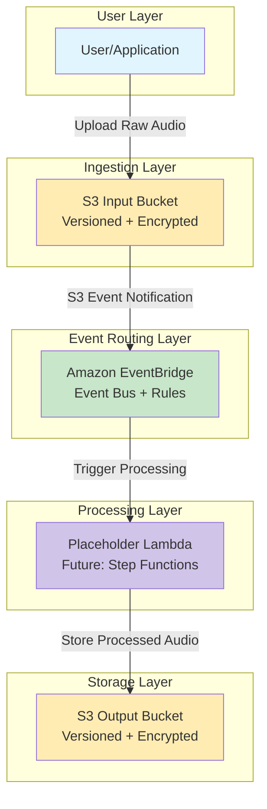

# Sleep Audio Pipeline - Implementation Status

## ✅ Phase 1: Foundation (Issue #3 - COMPLETED)

The foundational infrastructure has been implemented following strict TDD principles. This phase establishes the core event-driven architecture without processing logic.

### Implemented Components

#### 1. S3 Input Bucket (`SleepAudioInputBucket`)
- ✅ Server-side encryption using S3-managed keys (AES256)
- ✅ Versioning enabled for file history and rollback support
- ✅ EventBridge integration enabled for Object Created events
- ✅ Block all public access (private bucket)
- ✅ Enforce SSL/TLS for data in transit
- ✅ Retention policy set to RETAIN (prevents accidental deletion)

#### 2. S3 Output Bucket (`SleepAudioOutputBucket`)
- ✅ Server-side encryption using S3-managed keys (AES256)
- ✅ Versioning enabled
- ✅ Block all public access (private bucket)
- ✅ Enforce SSL/TLS for data in transit
- ✅ Retention policy set to RETAIN

#### 3. EventBridge Rule (`SleepAudioProcessingRule`)
- ✅ Triggers on S3 "Object Created" events from the Input Bucket
- ✅ Event pattern filters for source: aws.s3 and detail-type: Object Created
- ✅ Rule enabled by default
- ✅ Targets a placeholder Lambda function (temporary until Step Functions is implemented)
- ✅ Proper IAM permissions automatically configured by CDK

#### 4. Placeholder Lambda Function (`PlaceholderProcessorFunction`)
- ✅ Temporary Lambda function serving as EventBridge target
- ✅ Will be replaced with Step Functions state machine in Issue #4
- ✅ Has read permissions on Input Bucket
- ✅ Has write permissions on Output Bucket
- ✅ CloudWatch Logs retention set to 1 week
- ✅ Environment variable pointing to Output Bucket

### Security Features Implemented

- **Encryption**: All S3 buckets use server-side encryption (S3-managed keys)
- **Network Security**: All buckets enforce SSL/TLS for data in transit
- **Access Control**: All buckets block public access completely
- **IAM Least Privilege**: Lambda function has minimal required permissions (read input, write output)
- **Resource Protection**: Buckets have RETAIN removal policy to prevent accidental data loss

### Infrastructure as Code

- **CDK L2 Constructs**: Using high-level CDK constructs for better defaults and less boilerplate
- **Type Safety**: Go implementation provides compile-time type checking
- **Testing**: Comprehensive unit tests using CDK assertions verify all resource properties
- **Outputs**: CloudFormation outputs expose bucket names for reference and integration

### Test Coverage

All infrastructure components are covered by automated tests:
- ✅ `TestSleepAudioInputBucket` - Verifies input bucket properties
- ✅ `TestSleepAudioOutputBucket` - Verifies output bucket properties
- ✅ `TestEventBridgeRule` - Verifies event rule configuration
- ✅ `TestStackSnapshot` - Snapshot test for CloudFormation template

### Event Flow (Current Implementation)

```
User Upload → Input S3 Bucket → EventBridge Rule → Placeholder Lambda → Output S3 Bucket
```

This minimal flow establishes the event-driven foundation. Future issues will replace the placeholder Lambda with a Step Functions state machine orchestrating multiple processing steps.

### Architecture Diagram (Phase 1)



## Next Steps

- **Issue #4**: Step Functions State Machine Skeleton + Polly Integration (will replace placeholder Lambda)
