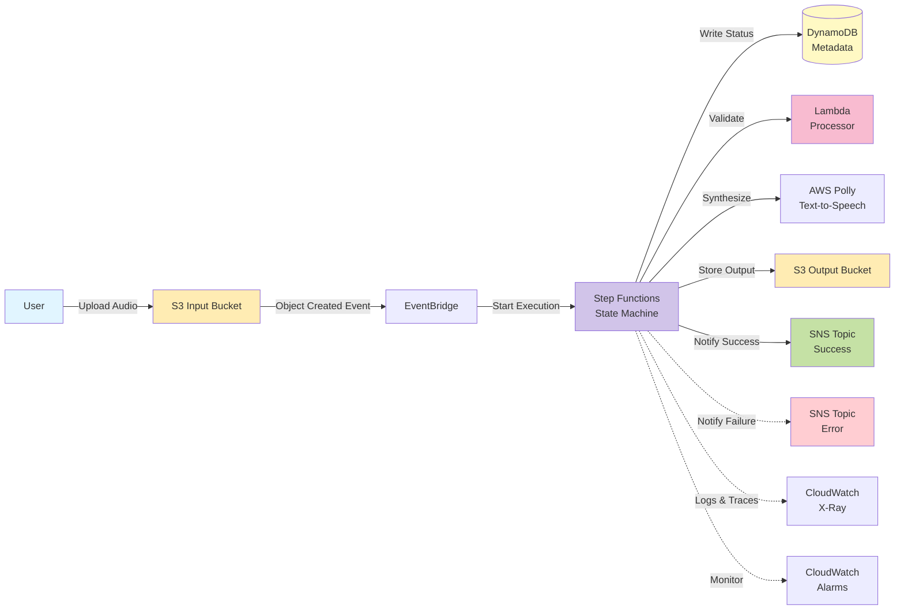

# CDK Sleep Audio Pipeline

[](https://aws.amazon.com/cdk/)
[](https://golang.org/)
[](https://en.wikipedia.org/wiki/Test-driven_development)
[](LICENSE)

A production-ready, event-driven serverless audio processing pipeline built with **AWS CDK in Go**, following **strict Test-Driven Development (TDD)** principles. This project demonstrates comprehensive IaC best practices with full observability, security, and multi-environment support.

> 📘 **Experiment Design**: This project is part of a TDD IaC experiment. See **[EXPERIMENT.md](./EXPERIMENT.md)** for comprehensive methodology, prompting patterns, and lessons learned.

## 🎯 Project Overview

The Sleep Audio Pipeline processes audio files through a fully serverless, event-driven architecture on AWS:

1. **Upload**: User uploads audio/text file to S3
2. **Trigger**: S3 event routes through EventBridge to Step Functions
3. **Process**: State machine orchestrates validation, AI synthesis, and storage
4. **Notify**: SNS publishes success/failure notifications
5. **Track**: DynamoDB maintains metadata and processing state

### Key Features

✅ **Event-Driven Architecture** - Loose coupling with EventBridge  
✅ **Serverless-First** - No infrastructure to manage  
✅ **Production-Ready** - Error handling, retry policies, observability  
✅ **Multi-Environment** - Dev, stage, prod with CDK Pipelines  
✅ **Security by Design** - KMS encryption, least-privilege IAM  
✅ **Comprehensive Testing** - 60+ tests with CDK Assertions  
✅ **Living Documentation** - Architecture-as-code with Mermaid diagrams

## 📚 Documentation

| Document | Purpose |
|----------|---------|
| **[EXPERIMENT.md](./EXPERIMENT.md)** | 🔬 **Experiment design, methodology, and observations** |
| [ARCHITECTURE.md](./ARCHITECTURE.md) | 🏗️ System architecture, components, data flows, ADRs |
| **[FINAL-REPORT.md](./FINAL-REPORT.md)** | 📋 **Final experiment report and self-assessment** |
| [META-PROMPTS.md](./META-PROMPTS.md) | 🤖 Reusable TDD patterns and meta-prompts |
| [SUMMARY.md](./SUMMARY.md) | 📊 Project summary, statistics, and insights |
| [CONTRIBUTING.md](./CONTRIBUTING.md) | 🤝 Development guidelines and TDD workflow |
| [.github/AGENT_GUIDELINES.md](./.github/AGENT_GUIDELINES.md) | 🎭 AI agent persona and workflow |

## 🏗️ Architecture



See [ARCHITECTURE.md](./ARCHITECTURE.md) for comprehensive architecture documentation.

## 🧪 Test-Driven Development

This project was built using **strict TDD** with the **Red-Green-Refactor** cycle:

1. **🔴 RED**: Write failing test first
2. **🟢 GREEN**: Write minimal code to pass test
3. **♻️ REFACTOR**: Improve code while keeping tests green

**Test Coverage**: 60+ comprehensive tests covering:
- Infrastructure components (S3, DynamoDB, EventBridge, Step Functions, Lambda, SNS)
- IAM permissions (least-privilege validation)
- Integration (end-to-end wiring)
- Configuration (multi-environment)
- Observability (X-Ray, CloudWatch, alarms)

```bash
# Run all tests
go test -v ./...

# Run tests with coverage
go test -v -cover ./...
```

## 🚀 Quick Start

### Prerequisites

- [Go 1.21+](https://golang.org/dl/)
- [Node.js 18.x+](https://nodejs.org/) (for CDK CLI)
- [AWS CDK 2.x](https://docs.aws.amazon.com/cdk/): `npm install -g aws-cdk`
- [AWS CLI](https://aws.amazon.com/cli/) configured with credentials
- [Python 3.12+](https://www.python.org/) (for Lambda function)

### Installation

```bash
# Clone the repository
git clone <repository-url>
cd cdk-sleep-go-qdev

# Install Go dependencies
go mod download

# Install Lambda dependencies
cd lambda/audio-processor
pip install -r requirements.txt
cd ../..

# Bootstrap CDK (first time only)
cdk bootstrap aws://<account-id>/<region>
```

### Development Workflow

```bash
# Run tests
go test -v ./...

# Synthesize CloudFormation template
cdk synth --context environment=dev

# View deployment changes
cdk diff --context environment=dev

# Deploy to environment
cdk deploy --context environment=dev
```

### Multi-Environment Deployment

```bash
# Deploy to dev
cdk deploy --context environment=dev

# Deploy to stage
cdk deploy --context environment=stage

# Deploy to prod (requires approval)
cdk deploy --context environment=prod
```

## 🔬 Experiment Methodology

This repository represents the **Go + Q Developer** variant of a larger TDD IaC experiment.

**Experiment Matrix** (Theoretical): 5 Languages × 3 AI Agents
- **Languages**: Go, TypeScript, Python, Java, C#
- **AI Agents**: Q Developer, GitHub Copilot, Claude/Cursor

**This Repository**: `cdk-sleep-go-qdev` = **Go** + **Q Developer**

### Key Experiment Elements

1. **Strict TDD Discipline**: Red-Green-Refactor for every feature
2. **Issue-Driven Development**: 13 issues with clear acceptance criteria
3. **Architecture-as-Code**: Living documentation with Mermaid diagrams
4. **Meta-Prompting**: Structured prompts for AI agent guidance
5. **Pattern Extraction**: Reusable patterns documented in META-PROMPTS.md

📘 **See [EXPERIMENT.md](./EXPERIMENT.md) for comprehensive experiment design and observations.**

## 📊 Project Statistics

- **Issues Completed**: 13 (Issues #1-13)
- **Issues Completed**: 16 (Issues #1-16)
- **Lines of Code**: ~2,500+ (Go + Python + tests)
- **Documentation**: 7 major markdown files
- **Documentation**: 8 major markdown files
- **Status**: ✅ Core development complete
- **Test Coverage**: >80%
- **Status**: ✅ Experiment complete with final report
## 🛡️ Security & Best Practices

- **Encryption**: KMS encryption at rest and TLS in transit
- **IAM**: Least-privilege policies across all services
- **Network**: Private S3 buckets with public access blocks
- **Observability**: X-Ray tracing, CloudWatch Logs, alarms
- **Error Handling**: Retry policies with exponential backoff
- **Multi-AZ**: Automatic with DynamoDB and Lambda

## 🗺️ Roadmap

- ✅ Issues #1-13: Core pipeline complete
- ⏳ Issue #14: Experiment design document (current)
- ✅ Issue #14: Experiment design document
- ✅ Issue #15: Code quality, coverage, and reflection
- ✅ Issue #16: Final experiment report and self-assessment
- 🔮 Future: Integration testing with real AWS services
- 🔮 Transcoding pipeline with FFmpeg
- 🔮 Multi-region deployment

## 📄 License

This project is licensed under the Apache License 2.0 - see the [LICENSE](LICENSE) file for details.

## 🙏 Acknowledgments

Built with **Q Developer** following strict **Test-Driven Development** principles as part of an IaC experimentation initiative.

---
**Status**: ✅ Core Development Complete | 📘 **[Read Experiment Design →](./EXPERIMENT.md)**
